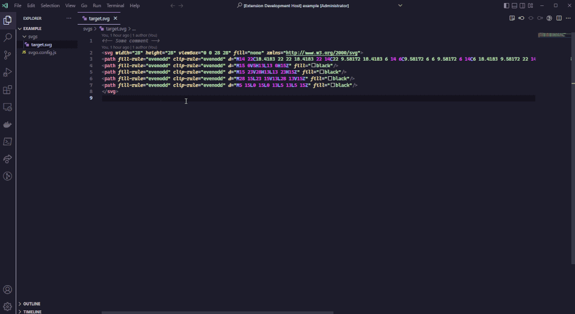

[]()

[](https://marketplace.visualstudio.com/items?itemName=shtian.svgocd)

 [](https://snyk.io/test/github/shtian/vscode-svgocd)

## ✨ Features

* Run SVGO on current open SVG file, or within text selection, through the extension command `SVGOCD: Optimize current SVG`
* Looks for and reads svgo.config.{js, mjs, cjs} file in the workspace
* Configure SVGO plugins directly through the SVGOCDs plugin settings
* Reports file size change upon optimization



## ⚙️ Settings
Settings can either be configured from the extension settings or having a svgo.config.{js,mjs,cjs} file in the workspace directory. A svgo config file will override the extension settings. See the [svgo npm package repository](https://github.com/svg/svgo#configuration) for more information about configuration. 

### Config file
  
```js
module.exports = {
  multipass:
  js2svg: {
    indent: 2,
    pretty: true,
  },
  plugins: [
    {
      name: 'sortAttrs',
      params: {
        xmlnsOrder: 'alphabetical',
      },
    },
  ],
};
```

### Extension settings
Supports all default SVGO plugin settings through extension settings (`svgocd.plugins.*`). Boolean values to enable/disable or object values for plugin settings can be used. Full list of plugins from https://github.com/svg/svgo :

<details>
  <summary>View all plugin settings</summary>
  
| Plugin | Description |
| ------ | ----------- |
| [cleanupAttrs](https://github.com/svg/svgo/blob/master/plugins/cleanupAttrs.js) | cleanup attributes from newlines, trailing, and repeating spaces |
| [inlineStyles](https://github.com/svg/svgo/blob/master/plugins/inlineStyles.js) | move and merge styles from `<style>` elements to element `style` attributes |
| [removeDoctype](https://github.com/svg/svgo/blob/master/plugins/removeDoctype.js) | remove doctype declaration |
| [removeXMLProcInst](https://github.com/svg/svgo/blob/master/plugins/removeXMLProcInst.js) | remove XML processing instructions |
| [removeComments](https://github.com/svg/svgo/blob/master/plugins/removeComments.js) | remove comments |
| [removeMetadata](https://github.com/svg/svgo/blob/master/plugins/removeMetadata.js) | remove `<metadata>` |
| [removeTitle](https://github.com/svg/svgo/blob/master/plugins/removeTitle.js) | remove `<title>` |
| [removeDesc](https://github.com/svg/svgo/blob/master/plugins/removeDesc.js) | remove `<desc>` |
| [removeUselessDefs](https://github.com/svg/svgo/blob/master/plugins/removeUselessDefs.js) | remove elements of `<defs>` without `id` |
| [removeXMLNS](https://github.com/svg/svgo/blob/master/plugins/removeXMLNS.js) | removes `xmlns` attribute (for inline svg, disabled by default) |
| [removeEditorsNSData](https://github.com/svg/svgo/blob/master/plugins/removeEditorsNSData.js) | remove editors namespaces, elements, and attributes |
| [removeEmptyAttrs](https://github.com/svg/svgo/blob/master/plugins/removeEmptyAttrs.js) | remove empty attributes |
| [removeHiddenElems](https://github.com/svg/svgo/blob/master/plugins/removeHiddenElems.js) | remove hidden elements |
| [removeEmptyText](https://github.com/svg/svgo/blob/master/plugins/removeEmptyText.js) | remove empty Text elements |
| [removeEmptyContainers](https://github.com/svg/svgo/blob/master/plugins/removeEmptyContainers.js) | remove empty Container elements |
| [removeViewBox](https://github.com/svg/svgo/blob/master/plugins/removeViewBox.js) | remove `viewBox` attribute when possible |
| [cleanupEnableBackground](https://github.com/svg/svgo/blob/master/plugins/cleanupEnableBackground.js) | remove or cleanup `enable-background` attribute when possible |
| [minifyStyles](https://github.com/svg/svgo/blob/master/plugins/minifyStyles.js) | minify `<style>` elements content with [CSSO](https://github.com/css/csso) |
| [convertStyleToAttrs](https://github.com/svg/svgo/blob/master/plugins/convertStyleToAttrs.js) | convert styles into attributes |
| [convertColors](https://github.com/svg/svgo/blob/master/plugins/convertColors.js) | convert colors (from `rgb()` to `#rrggbb`, from `#rrggbb` to `#rgb`) |
| [convertPathData](https://github.com/svg/svgo/blob/master/plugins/convertPathData.js) | convert Path data to relative or absolute (whichever is shorter), convert one segment to another, trim useless delimiters, smart rounding, and much more |
| [convertTransform](https://github.com/svg/svgo/blob/master/plugins/convertTransform.js) | collapse multiple transforms into one, convert matrices to the short aliases, and much more |
| [removeUnknownsAndDefaults](https://github.com/svg/svgo/blob/master/plugins/removeUnknownsAndDefaults.js) | remove unknown elements content and attributes, remove attrs with default values |
| [removeNonInheritableGroupAttrs](https://github.com/svg/svgo/blob/master/plugins/removeNonInheritableGroupAttrs.js) | remove non-inheritable group's "presentation" attributes |
| [removeUselessStrokeAndFill](https://github.com/svg/svgo/blob/master/plugins/removeUselessStrokeAndFill.js) | remove useless `stroke` and `fill` attrs |
| [removeUnusedNS](https://github.com/svg/svgo/blob/master/plugins/removeUnusedNS.js) | remove unused namespaces declaration |
| [prefixIds](https://github.com/svg/svgo/blob/master/plugins/prefixIds.js) | prefix IDs and classes with the SVG filename or an arbitrary string |
| [cleanupIDs](https://github.com/svg/svgo/blob/master/plugins/cleanupIDs.js) | remove unused and minify used IDs |
| [cleanupNumericValues](https://github.com/svg/svgo/blob/master/plugins/cleanupNumericValues.js) | round numeric values to the fixed precision, remove default `px` units |
| [cleanupListOfValues](https://github.com/svg/svgo/blob/master/plugins/cleanupListOfValues.js) | round numeric values in attributes that take a list of numbers (like `viewBox` or `enable-background`) |
| [moveElemsAttrsToGroup](https://github.com/svg/svgo/blob/master/plugins/moveElemsAttrsToGroup.js) | move elements' attributes to their enclosing group |
| [moveGroupAttrsToElems](https://github.com/svg/svgo/blob/master/plugins/moveGroupAttrsToElems.js) | move some group attributes to the contained elements |
| [collapseGroups](https://github.com/svg/svgo/blob/master/plugins/collapseGroups.js) | collapse useless groups |
| [removeRasterImages](https://github.com/svg/svgo/blob/master/plugins/removeRasterImages.js) | remove raster images (disabled by default) |
| [mergePaths](https://github.com/svg/svgo/blob/master/plugins/mergePaths.js) | merge multiple Paths into one |
| [convertShapeToPath](https://github.com/svg/svgo/blob/master/plugins/convertShapeToPath.js) | convert some basic shapes to `<path>` |
| [convertEllipseToCircle](https://github.com/svg/svgo/blob/master/plugins/convertEllipseToCircle.js) | convert non-eccentric `<ellipse>` to `<circle>` |
| [sortAttrs](https://github.com/svg/svgo/blob/master/plugins/sortAttrs.js) | sort element attributes for epic readability (disabled by default) |
| [sortDefsChildren](https://github.com/svg/svgo/blob/master/plugins/sortDefsChildren.js) | sort children of `<defs>` in order to improve compression |
| [removeDimensions](https://github.com/svg/svgo/blob/master/plugins/removeDimensions.js) | remove `width`/`height` and add `viewBox` if it's missing (opposite to removeViewBox, disable it first) (disabled by default) |
| [removeAttrs](https://github.com/svg/svgo/blob/master/plugins/removeAttrs.js) | remove attributes by pattern (disabled by default) |
| [removeAttributesBySelector](https://github.com/svg/svgo/blob/master/plugins/removeAttributesBySelector.js) | removes attributes of elements that match a css selector (disabled by default) |
| [removeElementsByAttr](https://github.com/svg/svgo/blob/master/plugins/removeElementsByAttr.js) | remove arbitrary elements by ID or className (disabled by default) |
| [addClassesToSVGElement](https://github.com/svg/svgo/blob/master/plugins/addClassesToSVGElement.js) | add classnames to an outer `<svg>` element (disabled by default) |
| [addAttributesToSVGElement](https://github.com/svg/svgo/blob/master/plugins/addAttributesToSVGElement.js) | adds attributes to an outer `<svg>` element (disabled by default) |
| [removeOffCanvasPaths](https://github.com/svg/svgo/blob/master/plugins/removeOffCanvasPaths.js) | removes elements that are drawn outside of the viewbox (disabled by default) |
| [removeStyleElement](https://github.com/svg/svgo/blob/master/plugins/removeStyleElement.js) | remove `<style>` elements (disabled by default) |
| [removeScriptElement](https://github.com/svg/svgo/blob/master/plugins/removeScriptElement.js) | remove `<script>` elements (disabled by default) |
| [reusePaths](https://github.com/svg/svgo/blob/master/plugins/reusePaths.js) | Find duplicated <path> elements and replace them with <use> links (disabled by default) |

</details>

## Changelog
## [3.0.1]

- docs: update changelog to match version

## [3.0.0]

- **feature**: update svgo to v2 and support new config file setup
- chore: use esbuild for bundling
- chore: update eslint and prettier packages
- ci: migrate from devops pipelines to github actions
- chore: migrate from npm to pnpm
## [2.0.0]

Skipped

## [1.1.4]

- chore(package): update prettier to major version 2

## [1.1.3]

- chore(package): update SVGO (1.3.2) and other patch releases

## [1.1.2]

- fix: read config on command run (#25)
- fix: calculate size based on svgo input/output (#25)

## [1.1.1]

- chore: update lock file with audit fix (#24)
- fix: read conf on workspace change (#23)

## [1.1.0]

- **feature**: add percentage file size change after optimization (by @lazreg87)

## [1.0.1]

- docs: update readme
- chore: replace tslint with eslint and add prettier

## [1.0.0]

- **feature**: support optimizing currently selected text
- **feature**: support reading .svgo.yml
- **feature**: support js2svg settings for pretty printing

## [0.1.6]

- fix: use HTTPS protocol for repo link in package.json

## [0.1.5]

- docs: update CHANGELOG.md

## [0.1.4]

- fix: add status message on SVGO runs

## [0.1.3]

- docs: fix README typos

## [0.1.2]

- docs: add tags and categories to package.json

## [0.1.1]

- ci: add publish scripts to package.json

## [0.1.0]

- **feature**: add configuration support
- **feature**: add command for optimizing current SVG 